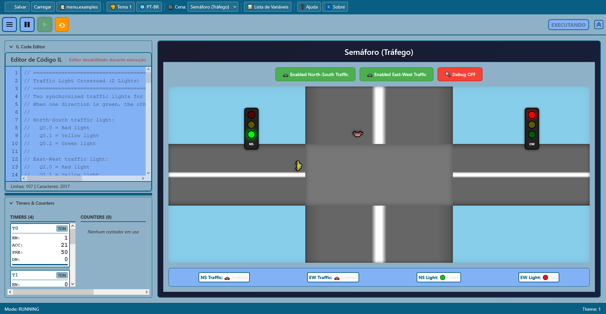
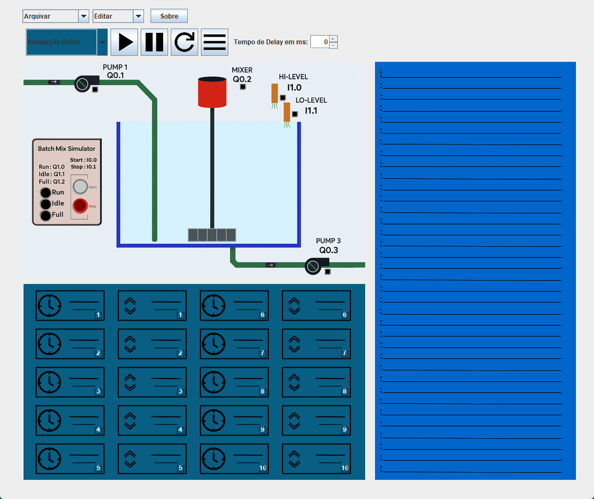

# 🤖 Simulador de CLP com Interface Interativa (Instruction List - IL)

📚 **Disciplina:** Controladores Lógicos Programáveis (CLP)

🎓 **Curso:** Engenharia de Computação

🏫 **Instituição:** IFTM - Instituto Federal do Triângulo Mineiro

📍 **Campus:** Uberaba - Parque Tecnológico

👨‍🏫 **Professor:** Robson Rodrigues

---

## 👥 Alunos

- Carlos Alexandre
- Matheus Calegari
- Luiz Antonio
- Eder Queiroz

---

## 📌 Descrição Geral do Projeto

O projeto consiste na criação de um ambiente de simulação de um CLP (Controlador Lógico Programável) no computador, com interface interativa para operar as entradas e saídas disponíveis no simulador de processo industrial.

O ambiente segue o ciclo de funcionamento de um CLP real e se inspira em simuladores existentes, como o LogixPro.

O projeto se baseia na versão desenvolvida pelos alunos do semestre 2024/02, disponível neste repositório:
🔗 [Repositório base no GitHub](https://github.com/IasminPieraco/Trabalho-Final-CLP)

---

## 🗂️ Estrutura do Projeto

Este repositório contém **duas versões** do simulador:

### 1️⃣ **Versão Original (Java Swing)** → [`java-original/`](./java-original/)
- Interface desktop em Java Swing
- Implementação completa do simulador PLC
- Suporta todas as instruções IL
- Versão legacy mantida para referência

### 2️⃣ **Versão Web Moderna (React + TypeScript + Electron)** → [`webConversion/`](./webConversion/)
- Interface web moderna com React e TypeScript
- Conversão completa do projeto Java original
- UI/UX aprimorada com componentes modernos
- **Disponível online:** [https://kiwiabacaxi.github.io/Simulador_Clp/](https://kiwiabacaxi.github.io/Simulador_Clp/)
- **Aplicação Desktop:** Build para Windows via Electron (testado em Windows)
- **Versão recomendada para uso**

📖 **Documentação completa:** Veja a pasta [`docs/`](./docs/) para guias de desenvolvimento, conversão e deployment.

---

## 🚀 Quick Start

### 🌐 Versão Web Online (Mais Rápido)

Acesse diretamente pelo navegador: **[https://kiwiabacaxi.github.io/Simulador_Clp/](https://kiwiabacaxi.github.io/Simulador_Clp/)**

### 💻 Versão Web Local (Desenvolvimento)

```bash
cd webConversion
npm install
npm run dev
```

Acesse em http://localhost:5173

### 🖥️ Versão Desktop (Electron - Windows)

```bash
cd webConversion
npm install
npm run build        # Build da aplicação web
npm run electron:build  # Build do executável Windows
```

O executável será gerado na pasta `dist/`

### ☕ Versão Java Original

```bash
cd java-original
./gradlew run
```

---

## 🛠️ Funcionalidades Obrigatórias

## 📝 Lista de Instruções Suportadas (Instruction List - IL)

- **LD:** Load – Carrega um valor para o acumulador.
- **LDN:** Load Negado – Carrega um valor negado para o acumulador.
- **ST:** Store – Armazena o conteúdo do acumulador no local especificado.
- **STN:** Store Negado – Armazena o conteúdo negado do acumulador no local especificado.
- **AND:** AND – Função booleana AND entre o operando indicado e o valor do acumulador.
- **ANDN:** AND Negado – Função booleana AND entre o operando indicado negado e o valor do acumulador.
- **OR:** OR – Função booleana OR entre o operando indicado e o valor do acumulador.
- **ORN:** OR Negado – Função booleana OR entre o operando indicado negado e o valor do acumulador.
- **TON:** Temporizador ON Delay – Ativa após um intervalo de tempo definido.
- **TOF:** Temporizador OFF Delay – Desativa após um intervalo de tempo definido.
- **CTU:** Count Up – Contador crescente.
- **CTD:** Count Down – Contador decrescente.
- **T1, T2, T3...:** Temporizadores – Referências aos temporizadores específicos.
- **I0.0, I1.7, I1.0...:** Entradas – Endereços das entradas do sistema.
- **Q0.1, Q1.7, Q1.0...:** Saídas – Endereços das saídas do sistema.
- **M1, M2, M3...:** Memórias – Memórias booleanas locais disponíveis.

---

### ✅ Data Table (Tabela de Variáveis)

- Uma ferramenta para visualizar todas as variáveis do sistema
  _(Inspirado na Data Table do LogixPro)_

### ✅ Modos de Operação

- 🛠️ **PROGRAM:** Permite edição do programa lógico, sem alterar saídas físicas.
- ⏸️ **STOP:** Programa do usuário parado.
- ▶️ **RUN:** Executa o programa lógico criado.

### ✅ Ciclo de Varredura do CLP Simulado

1. Inicializa o sistema
2. Lê as entradas e armazena na memória imagem
3. Processa o programa do usuário
4. Atualiza as saídas com base na memória imagem de saída
5. Retorna ao passo 2

### ✅ Salvamento e Carregamento de Programas

- Possibilidade de **salvar e carregar programas anteriores**

### ✅ Linguagem de Programação da Lógica do CLP

- **Instruction List (IL)**

### ✅ Exemplos de Programas

- 3 exemplos diferentes de código que utilizam:
  - Operações lógicas
  - Temporizadores
  - Contadores

### ✅ Instalador para Windows

- O simulador dispõe de um **instalador executável (.exe) para ambiente Windows** (via Electron)

---

## 🎨 Interface Interativa - Preview

### Versão Web Moderna

<!-- Adicione aqui uma screenshot da interface web atual -->


### Versão Java Original




---

## 📚 Tecnologias Utilizadas

### Versão Web
- **Frontend:** React 18 + TypeScript
- **Build Tool:** Vite
- **Styling:** CSS Modules
- **Desktop:** Electron
- **Deploy:** GitHub Pages
- **Gerenciamento de Estado:** React Hooks

### Versão Java Original
- **Linguagem:** Java
- **Interface:** Swing
- **Build:** Gradle

---

## 📦 Releases

O projeto possui sistema automatizado de releases via GitHub Actions. Para criar uma nova release:

```bash
# 1. Atualize a versão no package.json
# 2. Crie e publique uma tag
git tag v1.0.0
git push origin v1.0.0
```

O GitHub Actions automaticamente:
- ✅ Builda para Windows (x64 e x86)
- ✅ Cria uma GitHub Release com os instaladores
- ✅ Gera changelog automático

> 💡 Linux e macOS podem ser ativados futuramente se necessário

📖 **Guia completo:** Veja [`docs/RELEASES.md`](./docs/RELEASES.md) para instruções detalhadas

---

## 📖 Referências

- Projeto base: [https://github.com/IasminPieraco/Trabalho-Final-CLP](https://github.com/IasminPieraco/Trabalho-Final-CLP)
- LogixPro Simulator: Referência visual e funcional

---

## 📄 Licença

Este é um projeto acadêmico desenvolvido para fins educacionais no IFTM - Instituto Federal do Triângulo Mineiro.

**Licença MIT** - Veja o arquivo [LICENSE](LICENSE) para mais detalhes.

Copyright (c) 2025 - Carlos Alexandre, Matheus Calegari, Luiz Antonio, Eder Queiroz
